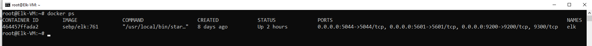

# elk-project
Developed an Azure environment and used ELK to monitor it.

## Automated ELK Stack Deployment

The files in this repository were used to configure the network depicted below.


These files have been tested and used to generate a live ELK deployment on Azure. They can be used to either recreate the entire deployment pictured above. Alternatively, select portions of the Ansible playbook files may be used to install only certain pieces of it, such as Filebeat.

  -  elk-project/Ansible/

This document contains the following details:
- Description of the Topology
- Access Policies
- ELK Configuration
  - Beats in Use
  - Machines Being Monitored
- How to Use the Ansible Build


### Description of the Topology

The main purpose of this network is to expose a load-balanced and monitored instance of DVWA, the D*mn Vulnerable Web Application.

Load balancing ensures that the application will be highly available, in addition to controlling excesssive traffic to the network. With the available jump box, I can restrict accessibility by providing one point of local access to the web servers. With the load balancer, I can remain confident that in the case of a DoS, the load balancer will be able to distribute the excessive traffic across the web servers and limit the chances of outages.

Integrating an ELK server allows users to easily monitor the vulnerable VMs for changes to the web servers and system logs.
With Filebeat installed on the Web Servers, I can centralize and monitor log files as well as changes in log events. With Metricbeat, I can maintain clarity of metric(virtual hardware) data across the web servers, including but not limited to, CPU usage, memory, file systems and network statistics.

The configuration details of each machine may be found below.

```markdown
| Name          | Function      | IP Address            | Operating System |
|---------------|---------------|-----------------------|------------------|
| Jump Box      | Gateway       | 13.70.107.29 10.0.0.4 | Linux            |
| Load Balancer | Load Balancer | 20.53.130.14          | -                |
| Web-1         | Web Server    | 10.0.0.7              | Linux            |
| Web-2         | Web Server    | 10.0.0.6              | Linux            |
| Web-3         | Web Server    | 10.0.0.9              | Linux            |
| ELK-VM        | ELK           | 10.1.0.5              | Linux            |
```

### Access Policies

The machines on the internal network are not exposed to the public Internet. 

Only the Jump Box machine can accept connections from the Internet. Access to this machine is only allowed from the following IP addresses:

- 45.132.224.xxx

Machines within the network can only be accessed by 10.0.0.5.

A summary of the access policies in place can be found in the table below.

```markdown
| Name          | Publicly Accessible | Allowed IP Addresses    |
|---------------|---------------------|-------------------------|
| Jump Box      |         Yes         | 45.132.224.xxx          |
| Load Balancer |          No         | 45.132.224.xxx          |
| Web-1         |          No         | 10.0.0.5/10.1.0.5       |
| Web-2         |          No         | 10.0.0.5/10.1.0.5       |
| Web-3         |          No         | 10.0.0.5/10.1.0.5       |
| ELK           |          No         | 45.132.224.xxx/10.0.0.5 |
```

### Elk Configuration

Ansible was used to automate configuration of the ELK machine. No configuration was performed manually, which is advantageous because it's efficient and saves time. Using one playbook I can configure multiple machines, given 3-3000+. As you can see, configuring each machine individually would be incredibly time consuming.

The playbook implements the following tasks:
- Install Docker
- Install Python3-pip
- Increase virtual memory to webservers
- Download and launch Docker Elk Container
- Enable Docker to start on boot

The following screenshot displays the result of running `docker ps` after successfully configuring the ELK instance.



### Target Machines & Beats
This ELK server is configured to monitor the following machines:
- Web 1 - 10.0.0.7
- Web 2 - 10.0.0.6
- Web 3 - 10.0.0.9

We have installed the following Beats on these machines:
- Filebeats
- Metricbeats

These Beats allow us to collect the following information from each machine:
Filebeat collects system log data from the webservers. Data you can expect to see can be anything from 	external IP addresses to changes in instances and services.
Metricbeat allows us to retrieve visual hardware data from the webservers, including changes in CPU usage, memory usage and changes to the file system.

### Using the Playbook
In order to use the playbook, you will need to have an Ansible control node already configured. Assuming you have such a control node provisioned: 

SSH into the control node and follow the steps below:
- Copy the `playbook.yml` file to `/etc/ansible`.
- Update the `hosts` file to include the IP of the machine you wish to configure. Filebeat configured systems are in the `[webservers]` group, whereas ELK configured machine is in `[elk]`
```bash
[webservers]
10.0.0.6 ansible_python_interpreter=/usr/bin/python3
10.0.0.7 ansible_python_interpreter=/usr/bin/python3
10.0.0.9 ansible_python_interpreter=/usr/bin/python3

[elk]
10.1.0.5 ansible_python_interpreter=/usr/bin/python3 
```
- Run the playbook, and navigate to the `http://publicip:5601` machine to check that the installation worked as expected. Your ELK machine should be configured to allow public access from your local machine.
- Also be sure to configure your `.config` files to allow the IP and ports of ELK.

### **Bonus**

#### From your Jump Box, as `root`
```bash
docker start 'ansible container name'
docker attach 'ansible container name'
```
#### In your Ansible container, navigate to `/etc/ansible`

Ensure `hosts` is configured with desired IP address. Then run.
```bash
ansible-playbook playbook.yml
```
Ensure `hosts` is configured with desired IP address.
